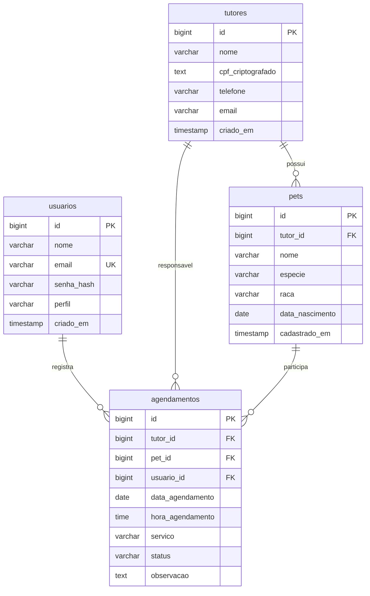

# Diagrama Entidade-Relacionamento

```mermaid
erDiagram
    usuarios ||--o{ agendamentos : registra
    tutores ||--o{ pets : possui
    tutores ||--o{ agendamentos : responsavel
    pets ||--o{ agendamentos : participa

    usuarios {
        bigint id PK
        varchar nome
        varchar email UK
        varchar senha_hash
        varchar perfil
        timestamp criado_em
    }
    tutores {
        bigint id PK
        varchar nome
        text cpf_criptografado
        varchar telefone
        varchar email
        timestamp criado_em
    }
    pets {
        bigint id PK
        bigint tutor_id FK
        varchar nome
        varchar especie
        varchar raca
        date data_nascimento
        timestamp cadastrado_em
    }
    agendamentos {
        bigint id PK
        bigint tutor_id FK
        bigint pet_id FK
        bigint usuario_id FK
        date data_agendamento
        time hora_agendamento
        varchar servico
        varchar status
        text observacao
    }
```
